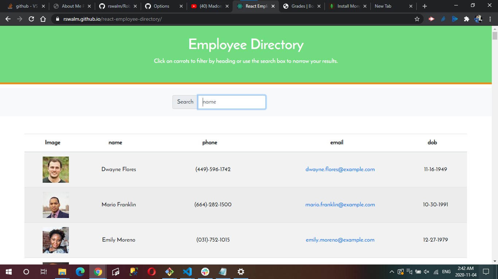
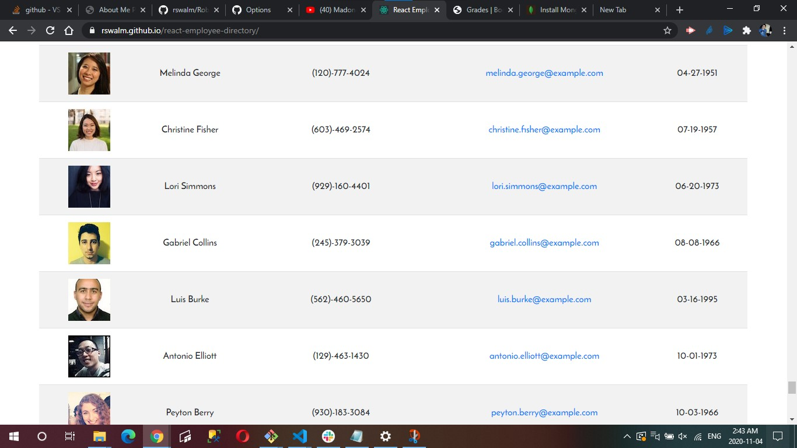
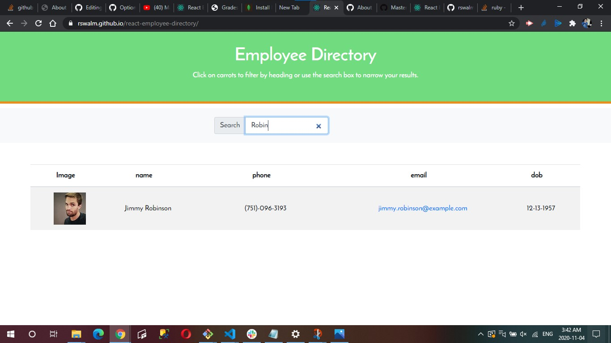

**Employee/User Directory**

I have created an employee directory with React. In order to create this directory I had to break up my application's UI into components, manage component state, so the user can respond to user events. The user is able to view their entire employee directory at once so that they have quick access to their information. The user will benefit greatly from being able to view non-sensitive data about other employees. it is particularly helpful because the user has the ability to filter employees by name.

**Application Features**
* Given a table of random users, when the user loads the page, a table of employees should render.
  
  * The user can do the following:
    * Sort the table by at least one category
    * Filter the users by at least one property.

# Links

## Deployed Web Application (Github Pages)
https://rswalm.github.io/react-employee-directory/

## Github Repository
https://github.com/rswalm/react-employee-directory/

## Deployed Web Application (Heroku)
https://robin-react-emp-directory.herokuapp.com/

